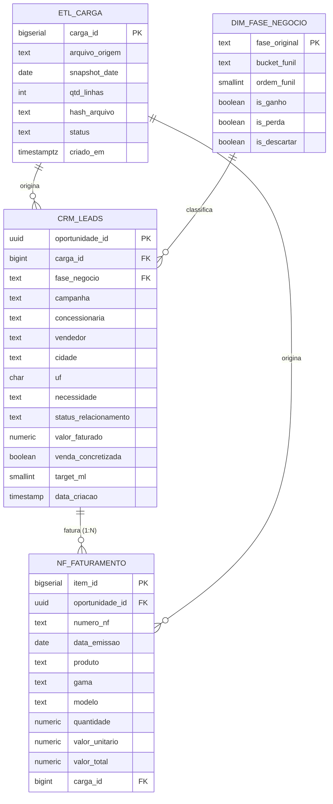

# TORO Insights — Modelo Entidade-Relacionamento (MER)

Modelagem **pragmática**: 1 fato (`crm_leads`) + 1 dimensão de governança
(`dim_fase_negocio`) + 1 auditoria de cargas (`etl_carga`). Campanha/Concessionária/
Vendedor/Município ficam denormalizados em `crm_leads` na v1 (ótimo p/ Pandas/
Streamlit) e podem virar dimensões próprias depois.

## Relacionamentos
- `etl_carga (1) → (N) crm_leads`: cada linha pertence à carga que a inseriu.
- `dim_fase_negocio (1) → (N) crm_leads`: cada oportunidade referencia uma fase.
- `crm_leads (1) → (N) nf_faturamento`: uma venda tem vários itens de NF; a
  receita da oportunidade é a soma dos `valor_total`. `oportunidade_id` **repete**
  em `nf_faturamento` (grão de item).
- Cliente (CPF/CNPJ) **não** é entidade própria na v1: pode repetir entre
  oportunidades; identificado por `documento` / `documento_hash`.
